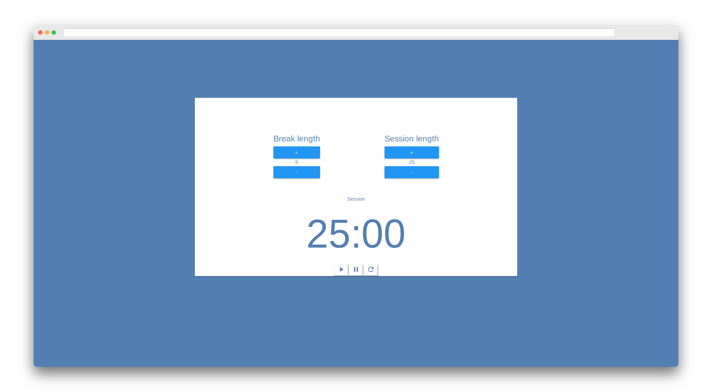

<h1 align="center">
Pomodoro Clock
</h1>

    Here is the 4th project I developed in React, another project I submitted for the front-end libraries <a src="http://freecodecamp.org">FreeCodeCamp</a> course.
    

---

## Features

It basically is a pomodoro clock implementation developed with material design, some features : 

* gives the choice to the user to choose his session length and his break length
* plays a little beep song when changing state between break and session

---

## Technologies used

* React